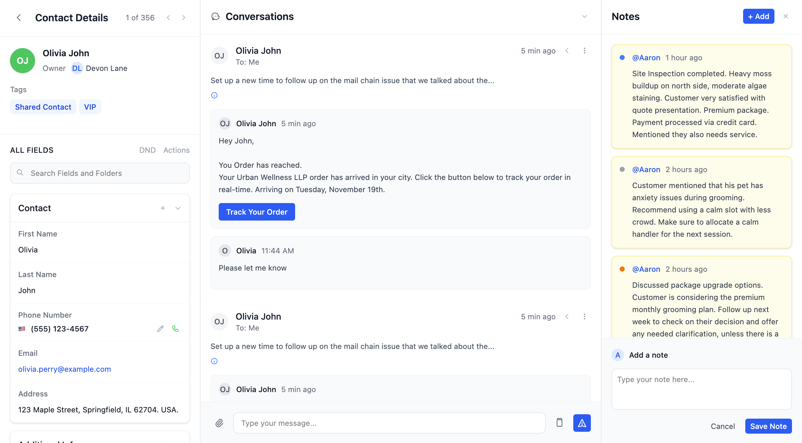
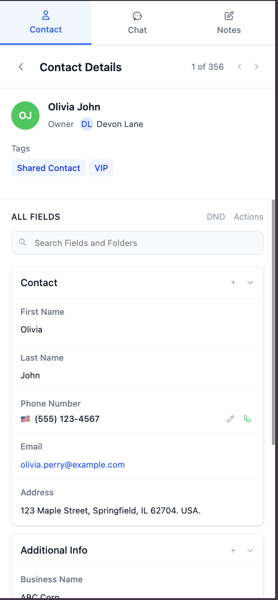

# Contact Details App

A modern React-based contact management application with conversations and notes functionality. Built with TypeScript, Vite, and Tailwind CSS.

## 📸 Screenshots

### Desktop View


_Full desktop layout showing all three panels: Contact Details, Conversations, and Notes_

### Features Showcase


_Contact details with expandable folders and field types_


_Real-time conversations with typing indicators and message tracking_


_Notes management with different note types and timestamps_

### Mobile View


_Mobile responsive design with tab navigation for switching between panels_

## 🚀 How to Run the App

### Prerequisites

- Node.js (version 18 or higher)
- npm or yarn package manager

### Installation & Setup

1. **Clone the repository** (if not already done)

   ```bash
   git clone <repository-url>
   cd contact-details
   ```

2. **Install dependencies**

   ```bash
   npm install
   ```

3. **Start the development server**
   ```bash
   npm run dev
   ```
   The app will be available at `http://localhost:5173`

### Available Scripts

- `npm run dev` - Start development server with hot reload
- `npm run build` - Build for production
- `npm run preview` - Preview production build locally
- `npm run lint` - Run ESLint for code quality checks

## 🛠️ Tech Stack

### Core Technologies

- **React 19.1.1** - UI library with latest features
- **TypeScript 5.8.3** - Type-safe JavaScript
- **Vite 7.1.2** - Fast build tool and dev server

### Styling & UI

- **Tailwind CSS 4.1.12** - Utility-first CSS framework
- **@tailwindcss/vite** - Vite integration for Tailwind

### Development Tools

- **ESLint 9.33.0** - Code linting and formatting
- **TypeScript ESLint** - TypeScript-specific linting rules
- **Autoprefixer** - CSS vendor prefixing

## 📁 Folder Structure

```
contact-details/
├── public/                     # Static assets
│   └── vite.svg
├── src/
│   ├── assets/                 # Images and static resources
│   │   └── react.svg
│   ├── components/             # Reusable React components
│   │   ├── contact-details/    # Contact details panel
│   │   │   ├── components/     # Sub-components
│   │   │   │   ├── contact-header/
│   │   │   │   ├── user-info/
│   │   │   │   ├── user-tags/
│   │   │   │   ├── field/
│   │   │   │   ├── folder/
│   │   │   │   └── all-fields-search/
│   │   │   ├── contact-details.tsx
│   │   │   └── index.tsx
│   │   ├── conversations/      # Conversations panel
│   │   │   ├── components/     # Sub-components
│   │   │   │   ├── conversations-header/
│   │   │   │   ├── chat-box/
│   │   │   │   ├── single-conversation-header/
│   │   │   │   ├── conversation-message/
│   │   │   │   └── typing/
│   │   │   ├── conversations.tsx
│   │   │   └── index.tsx
│   │   └── notes/              # Notes panel
│   │       ├── components/     # Sub-components
│   │       │   ├── notes-header/
│   │       │   ├── single-note/
│   │       │   └── add-note/
│   │       ├── notes.tsx
│   │       └── index.tsx
│   ├── data/                   # JSON configuration files
│   │   ├── contactData.json    # Contact information
│   │   ├── contactFields.json  # Field definitions
│   │   ├── conversations.json  # Chat conversations
│   │   ├── layout.json         # UI layout configuration
│   │   └── notes.json          # Notes data
│   ├── types/                  # TypeScript type definitions
│   │   └── index.ts
│   ├── app.tsx                 # Main app component
│   ├── main.tsx               # App entry point
│   ├── index.css              # Global styles
│   └── vite-env.d.ts          # Vite type definitions
├── package.json               # Dependencies and scripts
├── tsconfig.json             # TypeScript configuration
├── tailwind.config.js        # Tailwind CSS configuration
├── vite.config.ts           # Vite configuration
└── README.md                # This file
```

## 📄 JSON Configuration Files

### `contactData.json`

Contains the main contact information displayed in the app:

- Personal details (firstName, lastName, phone, email, address)
- Business information (businessName, streetAddress, city, country)
- Metadata (owner, followers, tags)

### `contactFields.json`

Defines the structure and types of form fields:

- **folders**: Groups fields into logical sections
- **fields**: Individual field definitions with key, label, and type
- **Field types**: `string`, `phone`, `email`, `radio`, `multi-select`

### `conversations.json`

Contains chat conversation data:

- **conversations**: Array of conversation objects
- Each conversation includes sender, recipient, timestamp, subject
- **messages**: Individual messages with content, timestamps, and special features
- **isTyping**: Boolean to show typing indicators

### `layout.json`

Defines the UI layout structure:

- **layout**: Array specifying the order of main panels
- Current layout: `["ContactDetails", "Conversations", "Notes"]`

### `notes.json`

Contains notes and annotations:

- **notes**: Array of note objects
- Each note has id, content, timestamp, and type
- **Note types**: `inspection`, `note`, `follow-up`

## 🐛 Known Issues

### Potential Improvements

- Add error boundaries for better error handling
- Implement proper state management (Redux/Zustand) for larger applications
- Add unit tests with Jest/Vitest
- Implement proper data fetching with loading states
- Consider adding a backend API instead of static JSON files

## 🔧 Development Notes

### Component Architecture

- Each major section (ContactDetails, Conversations, Notes) is broken into smaller, reusable components
- Components follow a consistent naming pattern with kebab-case directories
- Each component directory includes an `index.ts` for clean imports

### Styling Approach

- Uses Tailwind CSS utility classes for consistent styling
- Components are designed to be responsive and accessible
- Color scheme follows a professional, clean aesthetic

### Type Definitions

All TypeScript interfaces are centralized in `src/types/index.ts` for better maintainability and reusability across components.
